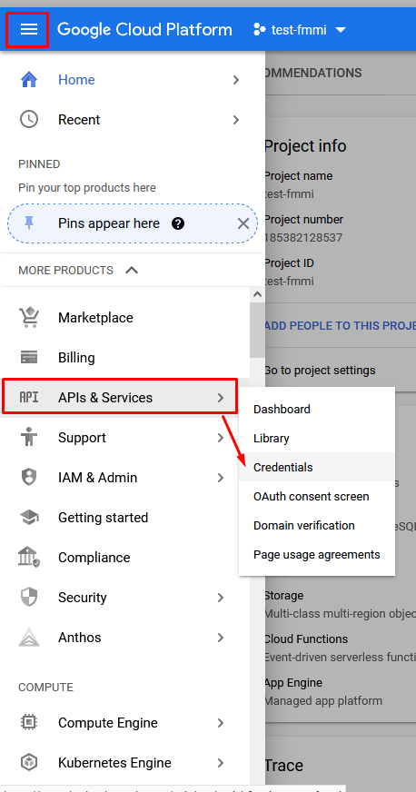

# Интеграция с Dialogflow



#### Для того, чтобы бот смог использовать накопившуюся базу знаний, необходимо произвести интеграцию сервиса Dialogflow с платформой Metabot24: 

* Зайдите в сервис Dialogflow, через ваш аккаунт Google.
* Откройте созданный проект **CakeBot.**
* Для установки интеграции DF с платформой Metabot24, необходимо получить уникальный ключ.
* Нажмите на кнопку **Настройки** в виде "шестеренки"&#x20;

.png>)

* В диалоговом окне нажать на ссылку в поле _Project ID._

.png>)

* Необходимо пройти регистрацию в облачном сервисе, для это надо заполнить следующие параметры:
  * _Страна_ - укажите страну проживания, выбрав из списка Russia;
  * _Условия использования_  - чекбокс перевести в активное состояние. Данный параметр подтверждает ваше согласие с правилами пользования  сервисом. Обязательно заполнять;
  * _Уведомления по электронной почте_ - параметр заполняется по желанию, если хотите получать рассылку от сервиса. Не обязательно заполнять;
  * Нажать кнопку _**Принять и продолжить**_.&#x20;

.png>)

* Система перенаправлена на консоль Google Cloud.

.png>)

Или диалоговое окно будет выглядеть так:

.png>)

* Далее переходим в раздел **API & Services** в подраздел **Credentials.**

.png>)

* Далее создать новые **Учетные данные**, для этого перейти в мастер создания учетных данных.

.png>)

* В блоке _Credential Type,_ необходимо указать какой API будет использоваться, выбрав **Dialogflow API**&#x20;
* &#x20;Указать параметры: _Application data_ и _No, I'm using them_. Нажать выбор типа учетных данных, нажав на кнопку _**NEXT**_, как показано на рисунке.

.png>)

* В блоке _Service account details_ (_Детали сервисного аккаунта)_ указать **Название сервисного аккаунта** латинскими буквами и нажать на кнопку _**Create and Continue**_.

.png>)

* &#x20; В блоке _Grant this service account access to project_ (предоставление этой учетной записи доступ к проекту) указав роль в поле _Role_ - **Project - Owner,** как показано на рисунке.&#x20;

.png>)

* Далее нажать на кнопку _**Continue.**_

.png>)

* В следующем диалоговом окне нажать кнопку _**DONE**_, оставив параметры последнего блока не заполненными, как на рисунке.

.png>)

* Следующим шагом настройки интеграции необходимо открыть созданный сервисный аккаунт на редактирование, как показано на рисунке.

.png>)

* В разделе _**Keys**_ (Ключи) создать новый авторизационный ключ - Create new key.

.png>)

* Активность параметра **JSON** оставляем без изменений, нажать на кнопку _**Create**_.

.png>)

* Браузер автоматически скачает файл с закрытым ключом, предложив его сохранить на диск. Рекомендуем сохранить файл для дальнейшей установки ключа на платформу.
* В информационном сообщении мы получим уведомление об успешном создании и скачивании закрытого ключа.

.png>)

* Открыть файл с ключом любым текстовым редактором, например: блокнотом, и скопировать весь текст в буфер обмена.

.png>)

* Переходим на платформу Metabot24 в ваш аккаунт.
* В разделе **Настройки бота** выбрать пункт [**Интеграции**](https://app.metabot24.com/bot-integration)**.**

.png>)

* [Создать](https://metabot24.com/bot-integration/create) новую интеграцию, нажав на кнопку **Новая привязка**.

.png>)

* В диалоговом окне заполнить следующие параметры:
  * _Интеграционная система_ - выбрать из списка Dialogflow;
  * _Авторизационный ключ (json)_ - из буфера обмена скопировать полностью текст закрытого ключа;
  * _Токен_ - параметр остается не заполненным;
  * Нажать кнопку _**Создать**_.

.png>)

* В разделе [**Интеграции с ботом**](https://app.metabot24.com/bot-integration) располагается список всех настроенных интеграционных привязок для данного бота с доступными операциями:&#x20;
  * _Редактировать_ - открывается форма для редактирования выбранной интеграции;
  * _Удалить -_ при нажатии производится удаление выбранной привязки.

.png>)

* Для того чтобы, предоставить доступ к вашему проекту другим пользователям с электронным адресом сервиса Google, необходимо в сервисе DF перейти на вкладку **Share.**
* В поле _Enter email_ добавить электронные адреса аккаунтов Google для ваших сотрудников и указать соответствующие роли.

.png>)

* Для каждого добавленного пользователя в проект DF необходимо указать одну роль:&#x20;
  * DEVELOPER - роль с функциями разработчика;
  * REVIEWER - роль с функцией наблюдатель, без права вносить правки в базу знаний..

.png>)

Нужно нажать на **Save** после добавления всех адресов, чтобы сохранить изменения.


Поздравляем Вас с успешным созданием интеграции с сервисом Dialogflow!


