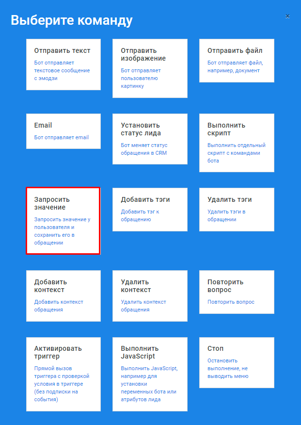

# Запросить значение

Функциональную команду запроса значений можно использовать в любой части вашего бота. В построенном диалоге вы можете добавить данную команду для того, чтобы, например, узнать Имя пользователя и тем самым данный атрибут будет записан в параметры пользователя. В дальнейшем можно будет использовать его, например, при рассылке уведомлений. 



Настроить команду _Запросить значение_ можно, выбрав одноименный пункт **Запросить значение** из списка **Команд**:



Параметр _Использовать условие_ - активность параметра позволяет создавать условие:

* если условие выполнено успешно, то данная команда будет выполнена
* если условие выполнено не успешно, то данная команда не будет выполнена

Подробнее с синтаксисом условий можно ознакомиться в разделе [JS условие выполнения команды](https://metarex.gitbook.io/metabot24/sintaksis-js-skripta-s-usloviem/js-uslovie-vypolneniya-komandy).


Параметр позволяет настраивать очень гибкие сценарии бота, в котором выполнение тех или иных команд зависит от выполнения условий. Например, зависит определенных действий пользователя или от полученных от него данных.


В диалоговом окне необходимо указать следующие параметры:

* **Имя переменной** - указать имя, с которым переменная будет записана в базу данных.
* **Подсказка-приглашение для пользователя** - текстовое сообщение понятное пользователю.

Нажать кнопку _**Создать**_.


В редакторе скриптов появится команда **Запросить значение**.



Если вы не хотите, чтоб значения запрашивались каждый раз или необходимо проверить вначале наличие сохраненных значение, то необходимо установить активность параметра _Использовать условие_ и описать [JS условие выполнения команды](https://metarex.gitbook.io/metabot24/sintaksis-js-skripta-s-usloviem/js-uslovie-vypolneniya-komandy).


Например: допустим надо проверить указал ли пользователь ранее значение _Имя_ и повторно его не запрашивать. Мы должны ввести проверяемое условие.

```javascript
if (lead.getAttr('Имя') == null) {
  return true;
}
```


В редакторе скриптов команда **Запросить значение** будет выглядеть следующим образом и будет выполняться только в том случае, если по Лиду не заполнено значение _Имя_.


По данной команде доступны следующие операции:

* Редактировать команду
* Удалить команду
* Перетащить для изменения порядка - удерживая иконку левой кнопкой мыши можно перетащить команду по списку вверх или вниз


Введенные значения будут записаны в поле _**Атрибуты**_ в разделе [**Лиды**](https://app.metabot24.com/lead)**.**


Редактировать или удалить введенные значения можно в разделе [**Атрибуты**](https://app.metabot24.com/bot-attribute).


