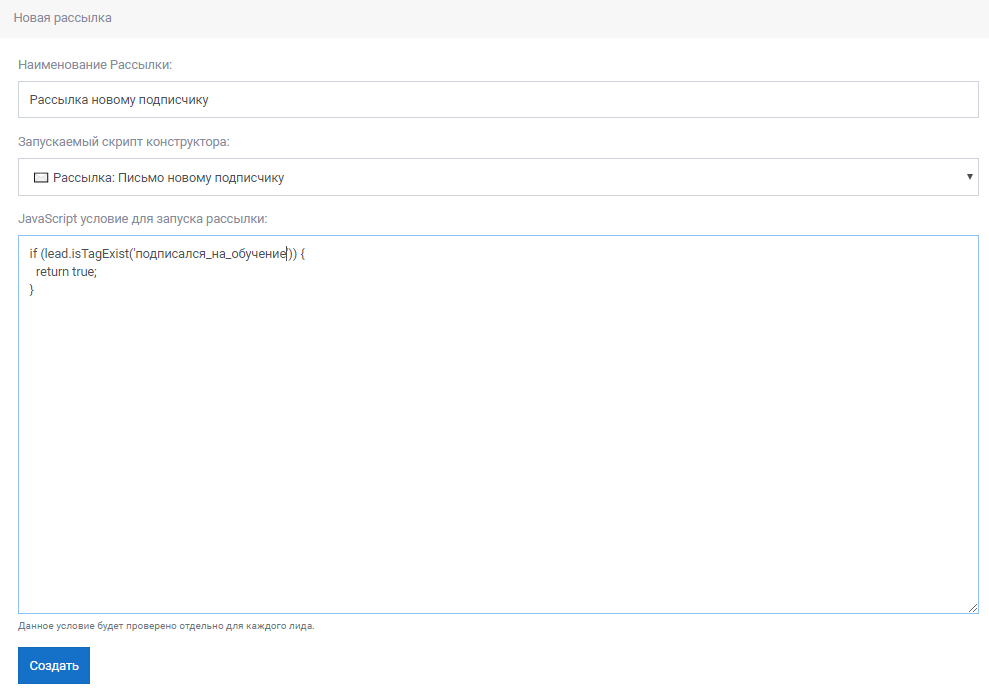

# Рассылки

Раздел [**Рассылки**](https://app.metabot24.com/bot-broadcast) служит для создания рассылок по заданному условию для списка  подписчиков.

Рассылки необходимо создавать в разделе главного меню **Настройки бота** подраздел [**Рассылки**](https://app.metabot24.com/bot-broadcast).

На экранной форме нажать кнопку [_**Новая рассылка**_](https://app.metabot24.com/bot-broadcast/create)**.**

При создании  новой рассылки необходимо заполнить следующие параметры:

* **Наименование Рассылки** - текстовое название рассылки, например: _Рассылка новому подписчику._
* **Запускаемый скрипт конструктора** _-_ из выпадающего списка выбрать ранее созданный скрипт, который будет запускаться при старте рассылки.
* **JavaScript условие для запуска рассылки** - JS условие при выполнении которого произойдет запуск рассылки, например: у пользователя добавился тэг - _подписался\_на\_обучение_.

Нажать кнопку _**Создать**_.


Сценарий скрипта рассылки должен быть описан заранее в отдельном скрипте, например как на рисунке ниже.


В данном разделе размещается список рассылок с доступными операциями по ним.

* **Запустить рассылку** - запуск рассылки будет произведен всем подписчикам по выполненному JS условию. Так как процесс не обратимый, то запуск выполняется при утвердительном ответе на предупреждающее сообщение.
* **Редактировать** - открывается форма редактирования настроек рассылки.
* **Удалить** - удалить рассылку из списка.
* **Подписчики** - список лидов-подписчиков, которым будет произведена рассылка.
* **Сообщения** - отчет о количествах сообщений по произведенной рассылке с возможностью отбора количества за период времени. 
  * Выбрать нужного подписчика или оставить параметр _Все._
  * Установить календарный период _С... - По..._, воспользовавшись календарем.
  * Нажать кнопку _**Применить фильтр**_.

После выполненной рассылки в списке **Лидов** отображается общее количество лидов, на которых была отправлена рассылка.

При переходе по ссылке **Лиды** открывается список лидов, которым была отправлена рассылка.

