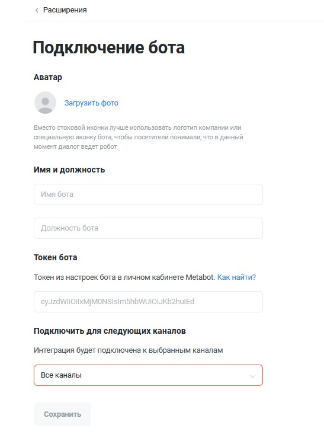
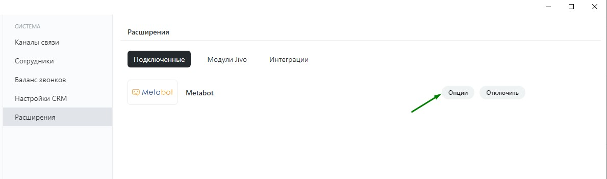

# Jivo

Интеграции сервиса [**Jivo**](https://www.jivo.ru) с [**Metabot24**](https://app.metabot24.com) позволяет подключить бота в диалоги с клиентами в любых каналах связи. При этом, все новые диалоги вначале будут отправляться боту. По сценарию бот может переключить диалог на оператора.

История диалогов с ботами автоматически сохраняется в архиве.

### Подключение интеграции

На платформе [**Metabot24**](https://app.metabot24.com) в настройках своего бота необходимо выполнить следующие действия:

* Перейти в раздел [**Настройки бота**](https://app.metabot24.com/bot-channel#) подраздел [**Каналы**](https://metabot.gitbook.io/documentation/panel-upravleniya-botom/kanaly)**;**
* Нажать кнопку **Новая привязка** и выбрать канал **Jivo**;

.png>)

* Установите активность параметра _Использовать inline-кнопки_;
* Остальные параметры пока можно оставить без изменений, по умолчанию и сохранить настройку.

.png>)

Далее нажмите пункт **Вебхук** и скопируйте сгенерированный вебхук. При копировании обратите внимание, чтобы не было вначале и в конце строки знаков «пробел».

.png>)

После получения вебхука, вам необходимо будет зайти в [приложение Jivo](https://app.jivosite.com/settings/integrations) в раздел **Каналы** **связи**, добавить канал, например, Telegram.

.png>)

Подключить канал и далее провести настройку раздела **Настройки интеграции для разработчиков.** Для этого необходимо включить опцию Включить Webhooks и  заполнить поле URL для Webhooks вставить скопированный вебхук, полученный в Metabot.

Аналогично сделать настройку для виджета и всех подключенных каналов.

.png>)

Перейдите по ссылке [**https://app.jivosite.com/settings/integrations/add-bot/31**](https://app.jivosite.com/settings/integrations/add-bot/31) и настройте расширение Metabot для подключения бота:

Затем настройте внешний вид бота, который будут видеть посетители, загрузив логотип компании или специальную иконку бота, указав имя и должность.

Перейдите на платформу [Metabot24](https://app.metabot24.com), в настройках бота в разделе [**Каналы**](https://app.metabot24.com/bot-channel) скопируйте в буфер обмена токен, как показано на рисунке.

.png>)

Далее укажите токен бота из личного кабинета Metabot24 и выберите, на каких каналах связи будет подключен бот.&#x20;

При копировании токена будьте внимательны, чтобы в начале и в конце строки не было знаков «пробел».

После нажатия кнопки _Сохранить_, интеграция будет подключена и данный бот отобразится в подключенных системах. Обратите внимание, что когда добавляются новые каналы и интегрируются с Metabot24, то необходимо не забывать включать в разделе **Опции** активность для новых каналов.

На этом всё. Бот подключен и готов к работе. Мы рекомендуем вам провести несколько тестовых диалогов, чтобы убедиться в правильности настройки сценариев. Увидеть активность пользователей при взаимодействии с ботом вы можете в разделе [**Лиды**](https://app.metabot24.com/lead) в личном кабинете Metabot24.

.png>)

### Настройка включения кнопок по каналам связи

Если по части каналов не поддерживаются или не корректно работают кнопки, то необходима настройка выборочного включения кнопок по каналам связи Jivo.

Данную настройку необходимо сделать вначале подключения канала Jivo. Для этого определить выбор в канале для каких мессенджеров используются кнопки.&#x20;

Если мессенджер не определен, то параметр берется из глобальной настройки канала из параметра _Использовать inline-кнопки._

Если мессенджер определен, по параметр берется из следующего перечисления:

* **Определяется общей настройкой канала** - установлен по умолчанию;
* **Да**  - использовать в канале кнопки;
* **Нет**  - не использовать в канале кнопки.


Теперь признак поиска мессенджера - это регулярное выражение, а также можно вводить несколько регулярных выражений, разделяя их символом |||

1. если хотим искать частичное вхождение указанного кода среди sender.url, то не указываем начало и конец строки в регулярном выражении, т.е. записываем просто строку metabotbot
2. если необходимо искать соответствие строки с sender.url, то указываем вначале ^, а в конце $, например, ^metabotbot$
3. если необходимо задействовать несколько регулярных выражений, то разделяем их |||, например, ^telegram$|||^tele.\*$


Проведем настройку кодов виджета и мессенджеров для определения наличия кнопок в мессенджере при обращении лида.

* **Jivo Widget** - канал _поддерживает_ кнопки, для виджета строка содержит [https://адрес-сайта.com](https://xn----7sbbarg4a4ckbn.com)

Поскольку код поиска  - это регулярное выражение, то можно использовать любые корректные конструкции применимые к регулярным выражениям, а это значит не забываем экранировать спец символы. Если хотим ясно искать точку то пишем \\. или вместо https:// нужно писать https:\\/\\/ - иначе регулярка будет некорректной и мессенджер не будет определен.

Например, если виджет установлен на для всех страницах сайта: ^https://metabot24.info/.\*$

Параметр _Использовать inline-кнопки для мессенджеров -_ **Да**

* **Telegram** - канал _поддерживает не более 7_ кнопок в меню.

Например, telegram&#x20;

Параметр _Использовать inline-кнопки для мессенджеров -_ **Да**

* **Viber** - канал _поддерживает не более 7_ кнопок в меню, для канала необходимо указать название группы в viber.

Например, ^metabotjivo$

Параметр _Использовать inline-кнопки для мессенджеров -_ **Да**

* **ВКонтакте** - канал _не поддерживает_ кнопки, содержит название группы, но по факту передается название канала.&#x20;


Если в Jivo настроена омниканальность, то могут возникнуть проблемы, поэтому рекомендуем подключать каждый мессенджер в Jivo как новый канал


Например, наименование группы полностью Metabot\_Jivosite или часть наименования обрамленная спецсимволами ^Metabot.\*$

Параметр _Использовать inline-кнопки для мессенджеров -_ **Нет**

* **Instagram** - канал _не поддерживает_ кнопки, содержит имя бизнес-аккаунта, но по факту передается название канала.&#x20;

Например, наименование группы полностью Metabot24 или часть наименования обрамленная спецсимволами ^Metabot.\*$

Параметр _Использовать inline-кнопки для мессенджеров -_ **Нет**

* **Facebook** - канал _не поддерживает_ кнопки, содержит наименование группы, но по факту передается название канала.&#x20;

Например, наименование группы полностью Metabot24 или часть наименования обрамленная спецсимволами ^Metabot.\*$

Параметр _Использовать inline-кнопки для мессенджеров -_ **Нет**

* **Avito** - канал _не поддерживает_ кнопки, содержит название канала.

Например, Avito

Параметр _Использовать inline-кнопки для мессенджеров -_ **Нет**

* **Apple Business Chat** - канал _не поддерживает_ кнопки, содержит название канала.

Параметр _Использовать inline-кнопки для мессенджеров -_ **Нет**

* **Одноклассники** - канал _не поддерживает_ кнопки, содержит название группы, но по факту передается название канала.&#x20;

Например, наименование группы полностью Metabot\_Jivosite или часть наименования обрамленная спецсимволами ^Metabot.\*$

Параметр _Использовать inline-кнопки для мессенджеров -_ **Нет**

Корректно настроенный канал должен выглядеть, например, так:

.png>)

### Заполнение контактных данных по лиду

После общения Лида (пользователя) с ботом можно в дальнейшем просмотреть его контактные данные: мессенджер, с которого общались, имя, телефон, e-mail.

Для этого в сервисе [**Jivo**](https://app.jivosite.com) **** необходимо выполнить следующие действия:

* По тестовому диалогу с каждого канала взаимодействия надо принять диалог оператором&#x20;

.png>)

* Далее завершить диалог Оператором или дождаться, когда это произойдет автоматически через некоторое время отсутствия активности:&#x20;

.png>)

* При изменении Оператором контактных данных по Лиду, когда оператор добавляет номер телефона или e-mail в карточке клиента в Jivo:

.png>)

* На платформе Metabot24 в истории сообщений хранится параметр widget\_id, который является уникальным для каждого канала. По тестовому Лиду перейдите в историю сообщений:

.png>)

* Далее перейдите по ссылке в webhooks-log:

.png>)

* В строках с параметрами в поле _Event Type_ = chat\_accepted/chat\_finished/chat\_updated необходимо открыть ссылку _**Show Formatted Payload**_

.png>)

* Cкопировать код параметра widget\_id:

.png>)

* Открыть на редактирование канал **Jivo** в настройках бота:

.png>)

* Вставить скопированный код в соответствующее поле мессенджера и сохранить настройки:

.png>)

* После этого при получении последующих CRM-вебхуков из этого канала для лидов будет прописываться соответствующий мессенджер, а также и все контактные данные из карточки лида отредактированные в сервисе **Jivo**.

.png>)

### Дополнительные возможности

1. Bot API сервиса **Jivo** не поддерживает вложения, поэтому изображения и прочие вложения отправляемые с платформы **Metabot24** клиенту приходят в виде текста **URL:**

* Telegram автоматически делает такую ссылку активной и даже подгружает изображение;
* Чат-виджет ссылку передает просто текстом и не кликабельной, поэтому ее можно только выделить и скопировать текст, далее вставить в адресную строку браузера.&#x20;

2\. Если в настройках канала включить параметр _Использовать inline-кнопки_, то кнопки прорисовываются и становятся кликабельны.

3\. При подключении Оператора в чат с Лидом сервис **Jivo** отправляет сообщение в мессенджер о присоединении Оператора к чату. При выходе Оператора из чата сервис **Jivo** не отправляет никаких сообщений и в боте также не отображается, что Оператор вышел из чата с Лидом.

4\. После завершения чата Оператором или если это произошло автоматически через определённое время простоя, теряется возможность отправки ботом сообщений в этот чат. Возможность возобновляется после перезагрузки данного чата Оператором или Лидом.

5\. Имеется возможность переключения на Оператора с помощью команд в боте, обратно переключение на бота может сделать только Оператор - **Выйти из чата**, но Лид должен заново начать диалог, написав сообщение, иначе бот не возобновит работу.

6\. Если Операторов нет онлайн, то при отправке сообщения приходит вебхук соответствующего события и в боте можно использовать вызов скрипта с типом **Нет доступных операторов**.

7\. При перенаправлении чата от одного Оператора другому Оператору, никаких событий от сервиса **Jivo** не поступает в **Metabot24** и этот момент не обрабатывается на платформе, в бота не отправляются уведомительные сообщения.

8\. Рекомендуемые настройки канала, для отображения чата.

Можно настроить автоматические действия и поведение чат-бота при недоступности Операторов, для этого в настройках канала в разделе **Автоматические действия** отключить все пункты и добавить новый пункт _Показать чат-бот при самом первом посещении сайта_, делается это с помощью кнопки **Добавить действие**.

.png>)

В новом пункте указать следующие рекомендованные настройки по условиям:

* Время на сайте
* Количество визитов
* Время от последнего активного приглашения

.png>)

При таких настройках окно чата будет показываться пользователю при первом посещении через 20 сек.

В разделе **Форма контактов** необходимо отключить запрос формы контактов клиента.

.png>)

В разделе **Кнопки в чате** можно настроить поведение чата при условии, что пользователь еще ничего не написал. Это рекомендуется настраивать, чтоб при повторном обращении в бота спустя время, пользователь мог нажать на кнопку и активировать бота или при первом посещении чата - окно чата не было пустым.

.png>)

### Каналы связи Jivo

На текущий момент Jivo обеспечивает следующий список каналов связи для возможного подключения:

.png>)
